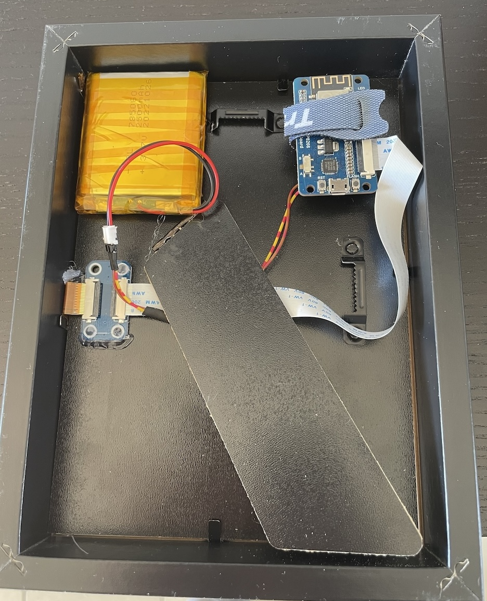

# ESP8266 ePaper Weather Dashboard - battery-driven

Inspired by [Weatherman Dashboard for ESPHome](https://github.com/Madelena/esphome-weatherman-dashboard).
Implemented Partial display refresh for nicer appearance and Deep Sleep for longer battery life time.

## Hardware

- Waveshare 13187 7.5inch e-Paper [link](https://www.welectron.com/Waveshare-13187-75inch-e-Paper)
- Waveshare 14138 e-Paper ESP8266 Driver Board [link](https://www.welectron.com/Waveshare-14138-e-Paper-ESP8266-Driver-Board)
- IKEA Ribba frame [link](https://www.ikea.com/at/de/p/ribba-bilderrahmen-schwarz-50378448/)
- TC4056A charging board [link](https://www.berrybase.at/ladeplatine-fuer-3-7v-liion/lipo-akkus-mit-ausgang-usb-type-c-buchse-loetpads-1000ma)
- 2500mAH Lithium-Polymer battery [link](https://www.berrybase.at/lp-785060-lithium-polymer/lipo-akku-3-7v-2500mah-mit-2-pin-jst-stecker)

## Software

- `Arduino`
- `GxEPD2` for controllling and drawing on the ePaper
- `ArduinoJson` for decoding the response from Home Assistant
- `RTCMemory` for storing a counter and determine when to perform a full display refresh
- [fonctconvert](https://github.com/adafruit/Adafruit-GFX-Library/tree/master/fontconvert) from AdafruitGFX to convert fonts to header files
- `rsvg-convert` to convert [Material Icons](https://fonts.google.com/icons) svg to png (with `find . -type f -name "*.svg" -exec bash -c 'rsvg-convert -h 512 "$0" > "$0".png' {} \;`)
- [image2cpp](https://javl.github.io/image2cpp/) for converting the created png files to header files with bitmaps

After boot, the ESP8288 makes a request to `http_endpoint` (Home Assistant sensor endpoint for the custom `epaper_esp8266_data` sensor) and retrieves all needed attributes as JSON. Afterwards, it renders the data to the ePaper display and goes to deep sleep for 10 minutes.

## Installation
- `cp src/secrets.h.template src/secrets.h` and fill out credentials (get the HA token from your Home Assistant profile page)
- add `home-assistant/espdata.yml` to your Home Assistant `configuration.yml` and reload the configuration
- open in VSCode with `PlatformIO` extension installed
- Connect the ES8266, Build, Upload

## Notes
- Connect `D0/GPIO16` to the `RTS` pin in order to get the deep-sleep working (afterwards, resetting and holding the flash button is needed for flashing)
- Don't connect USB and battery at the same time
- fontconvert: if the degree symbol should be included, define the right end character. I.e. `./fontconvert GothamRounded-Bold.otf 48 32 177`

(soldering + the mount on the back could be improved 😅)